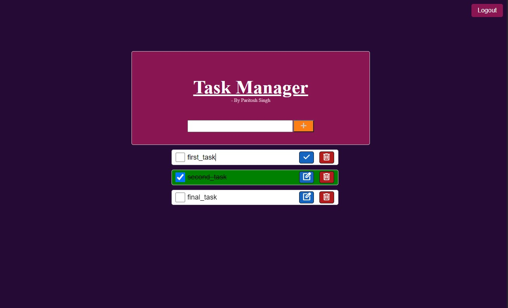

# Task Manager

Welcome to the Task Manager project! This project is a simple task management application that allows users to login and then create, edit, and delete tasks. It features a user-friendly interface for managing tasks efficiently with a decent UI.
| 
|-|
| Task Dashboard |
## About

This project is a full-stack web application developed using pure vanilla JavaScript in the frontend and Node.js in the backend. It leverages technologies such as Express.js for server-side routing, PostgreSQL for database management, JWT for user authentication and bcrypt for the encryption of sensitive data such as password.

## Features

- **Task Management:** Users can add, edit, and delete tasks.
- **User Authentication:** Secure user authentication is implemented using JWT tokens.
- **Responsive Design:** The application is designed to be responsive and work seamlessly across different devices and screen sizes.

## Getting Started

To get started with the Task Manager application, follow these steps:

1. Clone the repository to your local machine.
2. Install the required dependencies by running 
<br>```npm install```
3. Set up the PostgreSQL database by first installing PostgreSQL locally on your machine and then executing the SQL queries provided in the `db.sql` file.
4. Create a `.env` file in the root directory and add the necessary environment variables, including `PORT` and `secretKey`.
5. Start the server by running `npm start` or `node app.js`.
6. Access the application in your web browser by navigating to `http://localhost:{PORT}`.

## Folder Structure

- **`scripts/`**: Contains JavaScript files for client-side functionality.
- **`styles/`**: Contains CSS files for styling the frontend.
- **`app.js`**: The main server file containing the Express application setup and routing logic.
- **`package.json`**: The npm package file containing project dependencies and scripts.

## Contributions

Contributions to the Task Manager project are welcome! If you have suggestions for improvements, bug fixes, or would like to contribute new features, feel free to open an issue or submit a pull request.

## Contact

If you have any questions or feedback about the Task Manager project, feel free to reach out:

- [LinkedIn](https://www.linkedin.com/in/proparitoshsingh)
- [Twitter](https://twitter.com/proparitosh1609)
- [Send me an email](mailto:paritoshsingh1609@gmail.com)
<br><br><br>
<center>--- Paritosh Singh ---</center>